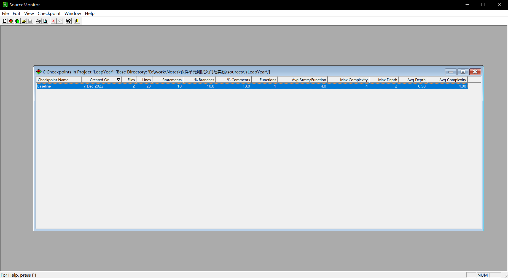
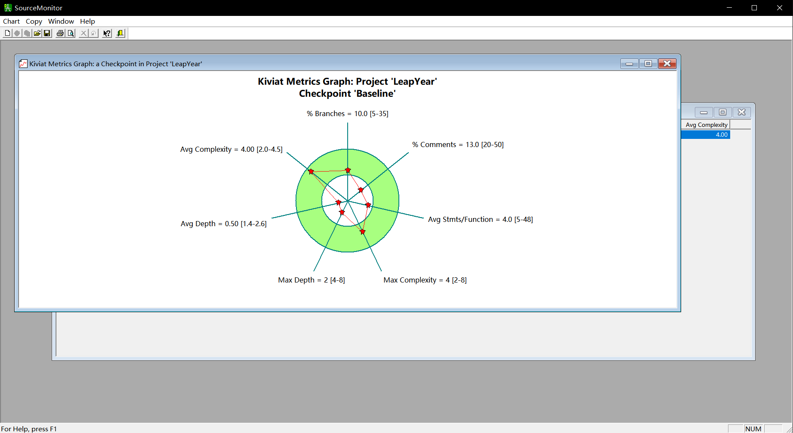

# 软件单元测试入门与实践

## 软件测试基础知识

### 什么是软件测试？

> 《GB/T15532 计算机软件测试规范》中对软件测试给出了定义：软件测试的目的是验证软件是否满足软件开发合同或项目开发计划、系统/子系统设计文档、软件需求规格说明、软件设计说明和软件产品说明等规定的软件质量要求；通过测试发现软件缺陷；为软件产品的质量评价提供依据。  

### 测试与调试的区别?

测试并不等于调试。测试需要有组织有计划的进行，其目的是为了发现缺陷并为软件产品的质量评价提供依据，而调试只是为了定位缺陷。

### 软件测试有效性

Glenford J . Myers在《The Art of Software Testing》一书中提到软件测试的目的：

+ 测试是为了证明程序有错，而不是证明程序无错；
+ 一个好的测试用例是在于它能发现至今未发现的错误；
+ 一个成功的测试是发现了至今未发现的错误的测试。

*那么没有发现缺陷的测试是有效测试吗？*
《GB/T 25000.10 系统与软件工程系统与软件质量要求和评价(SQuaRE) 第10部分：系统与软件质量模型》中，从**功能性、性能效率、兼容性、易用性、可靠性、信息安全性、维护性、可移植性**八个方面来评价软件的质量。只要在测试完成后有足够的证据证明软件符合这八个方面的要求，那么测试就是有效的。

### 谁为软件质量负责

从软件测试的二八原则来看，开发人员应该能够发现软件中80%的缺陷；而在开发人员未能发现的20%中，测试人员能够发现其中80%的缺陷；剩下4%的缺陷可能在用户使用过程中被发现，也有可能永远不会被发现。

### 软件测试分类

按照不同阶段分类：

+ **单元测试**：单元测试是针对软件设计的最小单位进行测试，这里的最小单位可以是模块，或面向对象编程中的类。目的是检查每个程序单元能否正确实现详细设计说明中的模块功能、性能、接口和设计约束等要求，发现各模块内部可能存在的各种错误。

+ **集成测试**：集成测试又称为组装测试。在单元测试的基础上，将各个程序单元进行有序、递增的组合测试。目的是验证软件单元之间、软件单元和已集成的软件系统之间的接口关系，并验证已集成的软件系统是否符合设计要求。

+ **确认测试**：确认测试是对已完成集成的软件系统进行测试。目的是验证软件系统本身是否与需求规格说明书中的要求一致。

+ **系统测试**：系统测试是在真实或模拟系统运行的环境下对集成了硬件和软件的系统进行测试。目的是检验系统在真实工作环境下的运行情况，以验证完整的软硬件系统能否实现用户的实际需求。
  
+ **验收测试**：验收测试是按照项目任务书或合同、供需双方约定的验收依据文档对整个系统进行测试以确定系统是否达到验收标准。验收测试的结论作为需要方是否接受该软件的主要依据。

按照是否需要了解内部结构划分：

+ **黑盒测试**：黑盒测试又称为数据驱动测试。在不了解软件的内部结构情况下，根据软件需求说明书中的要求设计测试用例，输入测试数据并验证输出结果，以验证软件表现是否与需求规格说明书中的要求一致。
  
+ **白盒测试**：白盒测试又称为逻辑驱动测试。对软件的结果进行分析，并设计测试用例，对软件的结构和执行路径进行检查，以验证软件是否能够按照设计说明书中的描述正常执行。

+ **灰盒测试**：灰盒测试也是一种数据驱动测试。与黑盒测试不同的是，根据需求规格说明书设计测试用例后，通过了解软件的内部结构补充测试用例，以提高测试的覆盖率。
***

## 单元测试概述

### 什么是单元测试

>单元测试是针对软件设计的最小单位进行测试。单元测试的“单元”在《GB/T15532 计算机软件测试规范》中的解释为“可独立编译或汇编的程序模块”。在实际操作中，可以认为承担一个单一职责的功能模块可以称为一个单元。

在C++中，通常情况下一个类会承担一个单一的职责，那么按类来划分单元是相对比较合理的。在C语言中，通常情况下一个文件中的代码会承担单一的职责，那么按文件来划分单元是相对比合理的。当然这不是绝对的，一个单元不能承担过多的指责，一个单元不能依赖太多其他的单元。

### TDD概述

**TDD全称测试驱动开发（Test-Driven Development）**，是一种增量式软件开发技术。即在没有失败的单元测试的前提下不可以写产品代码，开发产品代码的目的仅仅是为了让测试通过，依靠测试来推动开发的过程。

TDD开发过程如下：

+ 编写一个新的测试用例；
+ 编译代码，可能编译不通过；
+ 对功能代码做一部分改动，使得编译通过；
+ 运行所有测试，这时只有新的测试用例不通过；
+ 修改代码，让最新的测试用例通过；
+ 运行所有测试，确保所有测试用例通过；
+ 对代码进行重构，消除重复设计。

TDD可以帮助开发者解决很多没有单元测试的问题，然而TDD自身的缺点是显而易见的。首先是扭曲了开发的目标；其次让开发者做了很多无用功；最后TDD让开发者轻设计、重重构。

### 单元测试技术要求

在《GB/T15532 计算机软件测试规范》对单元测试做出了如下要求：

+ 对软件设计文档规定的软件单元的功能、性能、接口等应逐项进行测试；
+ 每个软件特性应至少被一个正常测试用例和一个被认可以异常测试用例覆盖；
+ 测试用例的输入应至少包含有效等价类、无效等价类和边界数据值；
+ 在对软件进行动态测试之前，一般应对软件单元的源代码进行静态测试；
+ 语句覆盖率达到100%；
+ 分支覆盖率达到100%；
+ 对输出数据及其格式进行测试。

***

## 静态测试

### 静态测试概述

> 静态测试是在不运行软件的情况下对软件进行测试。通过对程序代码和文档进行检查，以发现可能存在的错误。

静态测试可以从编码规则检查、代码结构分析和代码评审三个方面来进行。编码规则检查是将在编码过程中的一些注意事项形成规则并使用相关的工具进行检查；代码结构分析是使用工具对代码结构进行分析，避免代码过于复杂；代码评审则是由人对代码进行阅读，以发现代码中的一些潜在的错误。

### 编码规则检查

一般来说，将编译器的*警告等级设置到最高时*能够发现大部分的问题，所以在开发过程中首先需要将编译器的警告等级设置到最高然后消除编译器报告的所有警告。消除了编译器的所有警告后，代码可靠性已经是比较高的了，如果需要进一步提高代码的可靠性，可以通过专业的编码规则检查工具进一步检查。
可以选择**pc-lint**作为编码规则检查工具。与其他工具相比，**pc-lint**的检查更为全面，其中也集成了很多的行业标准。

### 预防Bug的十大编码规则

规则1：始终使用大括号
规则2：尽可能使用const关键字
规则3：尽可能使用static关键字
规则4：尽可能使用volatile关键字
规则5：不要注释掉代码
规则6：使用固定宽度的类型
>开发者在编写代码的过程中应该使用固定宽度的数据类型（int8_t，int16_t，int32_t，int64_t），以方便代码移植。

规则7：不要使用移位运算操作有符号数
规则8：有符号和无符号类型不要混用
规则9：尽量不要使用函数功能的宏
规则10：每行只定义一个变量

### 代码结构分析

在编写代码时，要求要结构清晰、接口简单。使用**SourceMonitor**作为代码结构检查工具。

然后在右键菜单中选择*Display CheckPoint Metrics Kiviat Graph*，查看某个检车点是否超标？

## 代码评审

代码评审有**代码走查**和**代码审查**两种方式。
> 代码走查是在评审人员充分理解了程序的意图后，设计测试用例，并由人充当计算机的角色，模拟计算机运行程序，以发现程序中的逻辑错误。

**代码走查**：

+ 首先将评审的材料发送给评审小组相关的成员，让评审小组充分理解程序的意图。评审材料包括需求文档、设计文档和软件代码。
+ 在评审小组各成员充分理解程序的意图后，设计测试用例，以小组为单位充当计算机的角色，按照测试用例的要求模拟计划机运行程序，在运行过程中大家进行必要的讨论。

代码走查与动态测试类似，都是使用测试用例运行程序。其区别是，代码走查并不是真正运行程序，而是以人充当计算机的角色模拟运行程序，能够很容易的覆盖到动态测试由于条件限制无法模拟的情况，但对人的逻辑思维能力要求也会比较高。

> 代码审查是评审员在充分理解了程序的意图后，通过阅读程序代码或由开发者讲解代码的方式，以发现程序中潜在的错误。

**代码审查**：

+ 需求确认：审查的第一项内容是程序代码是否正确实现了需求文档中的要求。
+ 设计确认：审查的第二项内容是程序是否与设计文档中的要求相符。
+ 代码规范：在确保程序代码正确实现需求且与设计文档相符后，接下来就可以对照代码规范对代码进行评审了。
+ 讨论环节：代码的效率足够高吗？代码的安全性足够高吗？代码方便后续维护吗？代码方便后续扩展吗？代码方便在其他项目中复用吗？代码是否考虑到了所有的异常情况？

**什么时候评审**？
建议的做法是从项目一开始编码就进行代码评审，每天下班前进行一次评审，针对当天编写或修改的代码。这种方式下每次评审的代码量不会很多，更容易达到效果；另外由于较早的开始进行评审，能够及时发现问题并进行修改，也能够更快的帮助开发者养成良好的编程习惯，尽可能的减少代码的返工率。

**评审哪些代码**？
在进行代码评审的时候，功能代码需要进行代码走查和代码审查，而测试代码需要进行代码审查。
***

## 测试用例设计

什么是测试用例？
> 一个测试用例描述了测试人员模拟用户使用系统的一个场景。在这个场景中，测试人员模拟用户的输入，并检测系统的输出是否与用户的期待输出是否一致。

在测试的过程中，实际上就是要控制被测模块的输入，检查被测模块的输出。所以输入输出的定义在测试过程中是至关重要的，如果输入输出定义错了，那么测试将变得无意义。

### 逻辑覆盖

什么是逻辑覆盖？
> 逻辑覆盖是以程序内部的逻辑结构为基础的测试用例设计方法，其目的是为了尽可能的覆盖程序的语句以及不同的判定条件。

+ **语句覆盖**的含义是，选择足够多的测试数据，使得程序中的每种语句都至少被执行一次。
+ **判定覆盖**的含义为，选择足够多的测试数据，使得程序中的每个判断语句至少出现一次真值和一次假值。
+ **条件覆盖**的定义为，当一个判定语句由多个条件组合而成时，选择足够多的测试数据，使得每一判定语句中的每个逻辑条件的可能的值至少出现一次。
+ **条件组合覆盖**的含义是，当一个判定语句由多个条件组合而成时，选择足够多的测试数据，使得各个条件的各种可能的组合都出现一次。

条件组合覆盖是覆盖率最高的一种逻辑覆盖方法。条件组合覆盖的缺点是测试数据的数量会很多。

**修正条件判定覆盖**的含义是，画出程序的控制流，选择足够多的测试数据，使得程序控制流中的每一条路径都执行一次。

### 数据覆盖

逻辑覆盖能够有效的发现问题。然而逻辑覆盖自身的缺点也是非常明显的。在使用逻辑覆盖的方法设计测试用例时，对实现的依赖性太高，以至于开发者很难考虑到代码本身没有考虑到的地方。

所以在进行单元测试的过程中，除了要使用逻辑覆盖之外，还需要使用另外的方法，那就是数据覆盖。只有两种方法同时使用，相互补充，才能最大限度的提高测试的覆盖率。

**边界值分析**在黑盒测试中经常被用到，在单元测试中也可以使用边界值分析来设计测试用例。通过大量的测试工作经验得知，应用程序往往容易在处理边界条件时发生错误，所以在测试过程中，通常也可以使用边界条件进行测试，只要边界条件没有问题，那么在数据范围内部出现问题的可能性是非常小的。

输入值可以分为几个不同的集合，每个集合触发不同的处理流程，而每个集合中的各个值也不一定是连续的，在这种情况下无法直接使用边界值进行分析，那么就需要使用到**等价类划分**。

当输入值可以划分为几个不同的集合，而每个集合又触发不同的处理流程时，那么每个集合就可以称为一个等价类，从一个等价类中选取少量的用例就可以代表该等价类中所有可能的输入。

在有些时候，被测单元可能的输入值为有限个离散的值，而一时之间又很难找出规律。在这种情况下可以对所有可能的输入值进行**穷举**，以达到完全覆盖。
